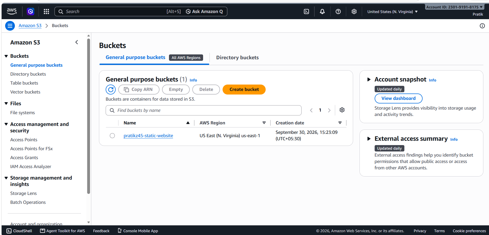
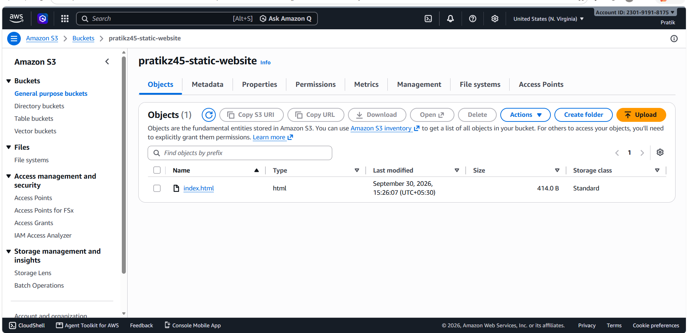
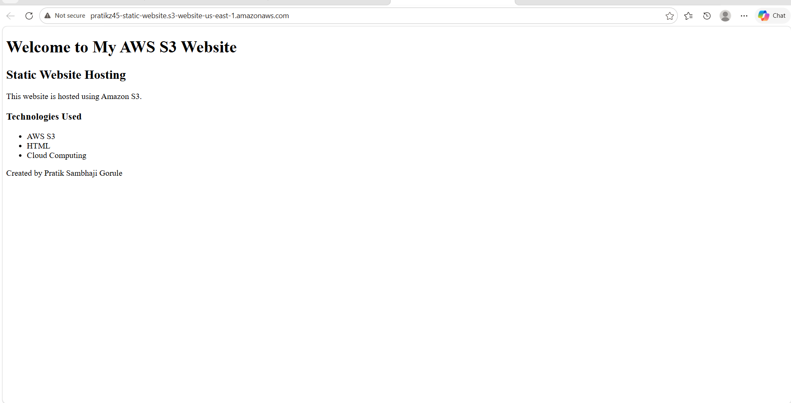

# AWS S3 Static Website Hosting

## Project Overview

This project demonstrates how to host a static website using Amazon S3.

I created an S3 bucket, uploaded an HTML webpage, enabled static website hosting, configured public access, and accessed the website through the S3 website endpoint.

## AWS Services Used

* Amazon S3
* S3 Static Website Hosting
* S3 Bucket Policy
* S3 Block Public Access

## Technologies Used

* HTML
* Amazon S3
* Cloud Computing

## Implementation Steps

### 1. Create S3 Bucket

Created an S3 bucket named `pratikz45-static-website`.

### 2. Upload Website File

Uploaded `index.html` to the S3 bucket.

### 3. Enable Static Website Hosting

Enabled **Static Website Hosting** from the S3 bucket Properties.

Configured:

* Index document: `index.html`

### 4. Configure Public Access

Configured the required S3 public access settings for website hosting.

### 5. Add Bucket Policy

Added a bucket policy that allows public read access to objects in the website bucket.

### 6. Test Website

Opened the S3 website endpoint in a browser and verified that the custom HTML webpage was successfully displayed.

## Website

The website is hosted using Amazon S3 Static Website Hosting.

## Project Screenshots

### 1. S3 Bucket

Shows the S3 bucket containing the website file.

### 2. Static Website Hosting

Shows Static Website Hosting enabled with `index.html` as the index document.

### 3. Live Website

Shows the custom HTML webpage successfully running through the S3 website endpoint.

## What I Learned

* How Amazon S3 stores objects
* How to create and configure an S3 bucket
* How to host a static website using S3
* How S3 Bucket Policies control access
* Understanding public access and Block Public Access settings
* How static websites can be deployed without a traditional web server

## Future Improvements

* Add CSS styling
* Add JavaScript functionality
* Use Amazon CloudFront for CDN delivery
* Configure HTTPS using CloudFront
* Add a custom domain using Route 53

## Project Screenshots

### 1. S3 Bucket

Shows the S3 bucket containing the website file.

### 2. Static Website Hosting

Shows Static Website Hosting enabled with `index.html` as the index document.

### 3. Live Website

Shows the custom HTML webpage successfully running through the S3 website endpoint.

## Author

**Pratik Sambhaji Gorule**

MCA Student | AWS & Cloud Computing | Linux | Python | DevOps Learner
